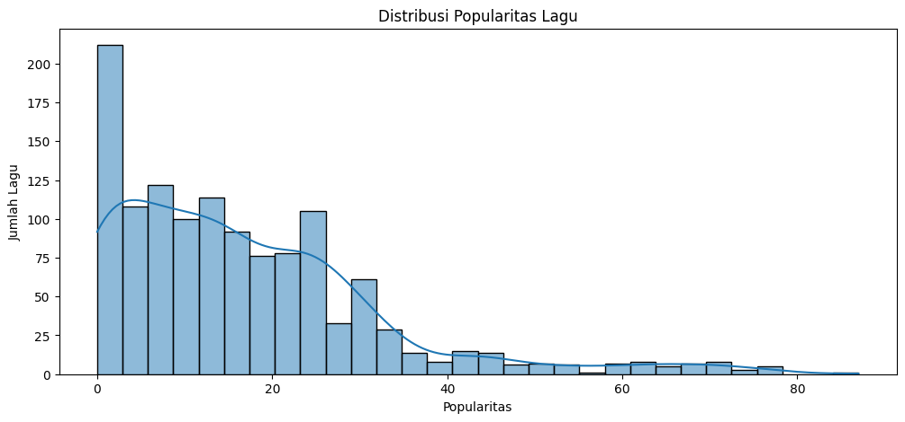
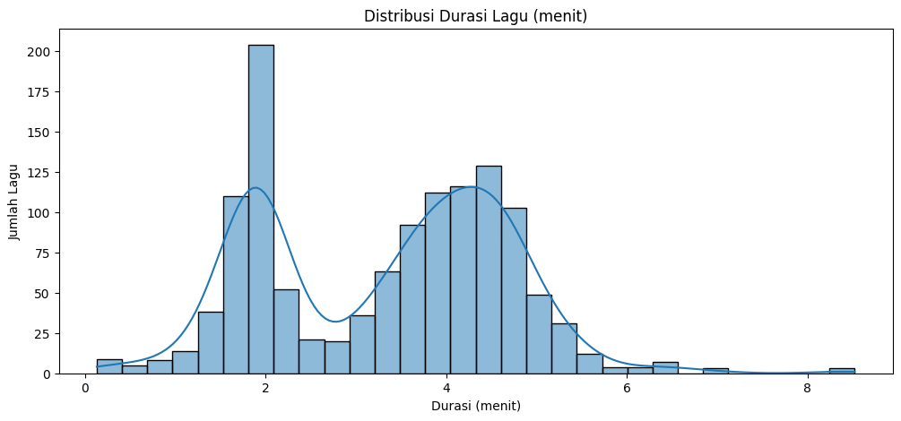
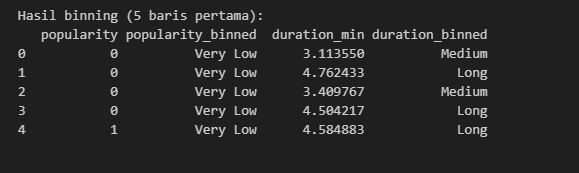
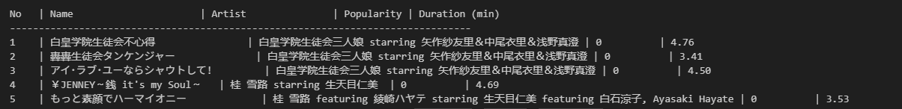
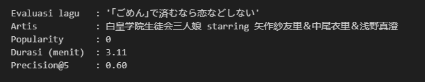
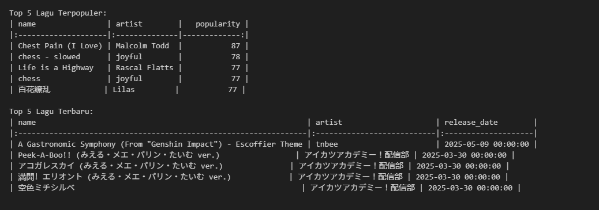

# 🎧 **Laporan Proyek Machine Learning – Krismono Sadi**

## 📌 Sistem Rekomendasi Lagu Spotify

### 🔍 Sumber Data

Dataset dikumpulkan melalui proses *scraping* menggunakan **Spotify Web API** resmi. Dokumentasi lengkap API dapat diakses melalui tautan berikut:

👉 [Spotify Developer API](https://developer.spotify.com/documentation/web-api?directory=true)

Dataset hasil *scraping* telah tersedia dan didokumentasikan secara terbuka di GitHub:

📁 [GitHub Repository - Musify Recommender](https://github.com/blasterdark300/musify-recommender)

---

## 🎵 Domain Proyek: Sistem Rekomendasi Musik

**Kategori Proyek**:

* Recommender System
* Information Retrieval
* Content-Based Filtering
* Machine Learning for Media & Entertainment

**Penjelasan**:

Proyek ini berada dalam domain sistem rekomendasi musik, cabang dari *Information Retrieval* dan *Machine Learning* yang berfokus pada pemberian rekomendasi lagu yang relevan kepada pengguna. Sistem ini menggunakan pendekatan **Content-Based Filtering**, yaitu memberikan rekomendasi berdasarkan kemiripan fitur lagu seperti durasi dan popularitas.

Ciri khas sistem ini:

* Tidak bergantung pada data interaksi pengguna seperti *ratings*, *likes*, atau *play history*.
* Rekomendasi diberikan berdasarkan fitur konten lagu itu sendiri.
* Bukan termasuk *Collaborative Filtering* karena tidak menggunakan profil pengguna.

---

## 📖 Project Overview

Di era digital saat ini, platform streaming musik seperti Spotify memiliki jutaan lagu, sehingga pengguna sering kesulitan menemukan lagu yang sesuai selera mereka. Sistem rekomendasi musik berperan penting dalam mengatasi tantangan ini dengan membantu pengguna menemukan lagu baru yang relevan.

Proyek ini mengembangkan sistem rekomendasi berbasis konten (**Content-Based Filtering**) yang menyarankan lagu-lagu mirip berdasarkan fitur numerik (contoh: durasi lagu dan popularitas) serta informasi artis. Sistem ini tidak memerlukan data interaksi eksplisit pengguna, sehingga cocok untuk kondisi *cold-start* atau pengguna baru.

---

## 🧠 Business Understanding

### 🎯 Problem Statements

* Bagaimana merancang sistem rekomendasi lagu yang relevan hanya berdasarkan fitur lagu?
* Bagaimana mengevaluasi performa sistem rekomendasi tanpa data interaksi pengguna seperti rating atau histori pemutaran?
* Bagaimana membersihkan data dari duplikasi dan data tidak valid agar hasil rekomendasi akurat?

### ✅ Goals

* Mengembangkan sistem rekomendasi **Top-N Lagu** menggunakan **Content-Based Filtering** berbasis fitur lagu.
* Melakukan evaluasi sistem menggunakan metrik **Precision\@K** dengan proxy relevansi lagu dari artis yang sama.
* Melakukan *data preparation* yang komprehensif untuk menjamin kualitas data.

### 💡 Solution Approach

* Menggunakan algoritma **Content-Based Filtering** dengan fitur numerik lagu seperti `popularity` dan `duration_ms`.
* Normalisasi fitur menggunakan **MinMaxScaler** untuk skala yang konsisten sebelum menghitung kemiripan dengan **Cosine Similarity**.
* Evaluasi relevansi menggunakan lagu dari artis yang sama sebagai proxy untuk menghitung **Precision\@K**.

---

## 📊 Data Understanding

Dataset berisi metadata lagu dari Spotify dengan 5.624 entri lagu, diperoleh dari [Music Spotify Dataset Cris](https://github.com/blasterdark300/musify-recommender.git). Data meliputi nama lagu, artis, popularitas, durasi, hingga tanggal rilis.

**Variabel utama:**

| Kolom         | Deskripsi                   |
| ------------- | --------------------------- |
| track\_name   | Nama lagu                   |
| artist\_name  | Nama artis                  |
| popularity    | Skor popularitas (0–100)    |
| duration\_ms  | Durasi lagu dalam milidetik |
| release\_date | Tanggal rilis lagu          |

**Statistik dan kualitas data:**

* Total data: 5.624 baris, 8 kolom.
* Nilai kosong ada pada kolom `preview_url` (semua kosong).
* Terdapat 4.379 baris duplikat berdasarkan kombinasi nama lagu dan artis.
* Outlier ditemukan pada fitur `popularity` dan `duration_ms`.

**Visualisasi fitur utama:**

* Distribusi popularitas lagu bervariasi dari sangat rendah hingga sangat tinggi.
* Durasi lagu tersebar mulai dari beberapa detik hingga lebih dari 10 menit.

Distribusi fitur populer dan durasi menunjukkan variasi lagu yang baik, dengan popularitas lagu berkisar dari sangat rendah hingga sangat tinggi, dan durasi lagu mulai dari beberapa detik hingga lebih dari 10 menit.

Distribusi Popularitas Lagu:  

Distribusi Durasi Lagu (menit):  

---

## 🧹 Data Preparation

Proses data preparation dilakukan sebagai berikut:

* **Penanganan Outlier:** Menggunakan metode Interquartile Range (IQR) untuk mendeteksi dan menghapus outlier pada fitur `popularity` dan `duration_ms`.

* **Penghapusan Duplikat:** Menghapus baris yang memiliki kombinasi `name` dan `artist` yang sama agar tidak terjadi redundansi data lagu.

* **Cek Ulang Missing Value:** Setelah duplikat dihapus, dilakukan pengecekan ulang terhadap nilai kosong (missing value) yang mungkin tersisa pada dataset.

* **Pengisian Nilai Kosong:** Fitur numerik yang masih memiliki nilai kosong diisi menggunakan **median** kolom masing-masing untuk menjaga konsistensi dan mengurangi bias.

* **Konversi Tipe Data:** Kolom `release_date` dikonversi ke tipe **datetime** agar dapat digunakan dalam analisis berbasis waktu seperti tren perilisan.

* **Binning (opsional):** Fitur `popularity` dibagi ke dalam 5 kelompok (bin) untuk memudahkan interpretasi dan analisis deskriptif.

* **Normalisasi:** Fitur numerik dinormalisasi menggunakan **Min-Max Scaling** agar semua fitur berada pada skala yang sama, penting untuk perhitungan kemiripan antar lagu.

---

Visualisasi Binning: 

---

## 🤖 Modeling

Model yang dikembangkan adalah sistem rekomendasi lagu berbasis **Content-Based Filtering** yang menggunakan **Cosine Similarity** untuk mengukur kemiripan antar lagu berdasarkan fitur numerik `popularity` dan `duration_ms`.

Sistem ini mampu memberikan rekomendasi **Top-N** lagu yang paling mirip dengan lagu input berdasarkan skor kemiripan tersebut.

### Visualisasi:

Top-N (5) Recommendation:

Hasil Precision:

### Proses Utama:

* Menghitung kemiripan antar lagu dengan mengukur sudut antara vektor fitur lagu yang telah dinormalisasi menggunakan Cosine Similarity.
* Menghasilkan output berupa daftar rekomendasi **Top-N** lagu yang memiliki kemiripan tertinggi dengan lagu input.

### Kelebihan:

* Tidak memerlukan data interaksi pengguna, sehingga sangat cocok untuk mengatasi masalah *cold-start* pada pengguna atau lagu baru.
* Implementasi sederhana, efisien, dan cepat terutama untuk dataset dengan ukuran sedang.
* Rekomendasi bersifat transparan karena didasarkan pada kemiripan fitur lagu yang konkret.

### Kekurangan:

* Kurang mampu menangkap preferensi pengguna yang kompleks dan dinamis.
* Rekomendasi terbatas pada fitur yang tersedia dalam dataset, sehingga variasi rekomendasi bisa kurang beragam.

---

### Alasan Memilih Content-Based Filtering dengan Cosine Similarity

Pendekatan Content-Based Filtering dengan Cosine Similarity sangat tepat untuk proyek ini karena:

* Dapat memberikan rekomendasi yang relevan hanya berdasarkan fitur lagu, tanpa bergantung pada data interaksi pengguna yang sering kali sulit diperoleh.
* Metode Cosine Similarity efektif dalam mengukur kemiripan antar fitur numerik yang telah dinormalisasi, sehingga hasil rekomendasi menjadi akurat dan mudah dipahami.
* Sederhana untuk diimplementasikan dan cukup cepat, cocok untuk prototipe sistem rekomendasi berbasis konten pada dataset lagu Spotify.

---

## 📈 Evaluation

Evaluasi dilakukan dengan metrik **Precision\@K**, yaitu proporsi lagu rekomendasi dalam top-K yang berasal dari artis yang sama dengan lagu input, digunakan sebagai proxy relevansi:

$$
Precision@K = \frac{\text{Jumlah lagu rekomendasi dari artis sama}}{K}
$$

Metrik ini dipilih karena tidak tersedia data interaksi pengguna. Hasil evaluasi menunjukkan precision yang memadai pada contoh lagu input, menandakan sistem dapat memberikan rekomendasi relevan secara artis dan karakteristik lagu.

---
## 📊 **Tambahan: Top Populer dan Terbaru**

🎵 Top 5 Lagu Paling Populer dan 🕒 Top 5 Lagu Terbaru

Sebagai pelengkap sistem rekomendasi, kami juga menampilkan daftar Top 5 Lagu Paling Populer dan Top 5 Lagu Terbaru dari dataset.

Top 5 Lagu Paling Populer
Daftar ini menampilkan lagu-lagu dengan skor popularitas tertinggi berdasarkan fitur popularity. Skor popularitas ini merefleksikan seberapa banyak lagu tersebut didengarkan dan diapresiasi oleh pengguna Spotify secara keseluruhan. Menyediakan daftar lagu populer dapat membantu pengguna menemukan hits terkini atau lagu yang sedang tren di kalangan pendengar.

Top 5 Lagu Terbaru
Daftar lagu terbaru disusun berdasarkan tanggal rilis (release_date) yang paling baru. Menampilkan lagu terbaru memungkinkan pengguna untuk mengikuti perkembangan musik terkini dan menemukan rilisan baru yang mungkin belum banyak diketahui. Ini penting untuk menjaga sistem rekomendasi tetap relevan dengan tren musik saat ini.

list lagu:

---
---
---

# 📏 **Jawaban Evaluasi: Kesesuaian dengan Business Understanding**

### 📌 Keterkaitan dengan Tujuan Bisnis

Evaluasi dilakukan untuk menilai sejauh mana model **Content-Based Filtering** yang dikembangkan mampu menjawab *problem statements* dan mencapai *goals* yang telah ditetapkan pada tahap **Business Understanding**. Evaluasi ini penting untuk memastikan bahwa sistem rekomendasi tidak hanya berjalan secara teknis, tetapi juga memberikan nilai nyata bagi pengguna dalam mengeksplorasi musik secara personal dan relevan.

---

### ✅ Apakah Model Telah Menjawab Problem Statements?

Iya Tentu, Ini Hasilnya : 

**🔹 Problem Statement 1:** *Bagaimana memberikan rekomendasi lagu yang relevan berdasarkan fitur lagu?*

✔️ Model menggunakan fitur numerik seperti `popularity` dan `duration_ms` yang telah dinormalisasi menggunakan **MinMaxScaler**. Kemudian, sistem menghitung **Cosine Similarity** antar lagu untuk mengidentifikasi kemiripan konten. Hasil rekomendasi menunjukkan lagu-lagu dengan karakteristik serupa, menjawab kebutuhan akan rekomendasi berbasis konten.

**🔹 Problem Statement 2:** *Bagaimana mengevaluasi sistem rekomendasi tanpa data interaksi pengguna?*

✔️ Sistem dievaluasi menggunakan metrik **Precision\@K**, dengan pendekatan bahwa lagu dari artis yang sama dianggap relevan sebagai *proxy ground truth*. Meskipun pendekatan ini bersifat heuristik, metode ini cukup representatif sebagai evaluasi awal sebelum data eksplisit pengguna tersedia.

---

### 🎯 Apakah Model Telah Mencapai Tujuan? **(Goals)**

✔️ Evaluasi & Insight
📌 Evaluasi lagu: '｢ごめん｣で済むなら恋などしない'
🎤 Artis: 白皇学院生徒会三人娘 starring 矢作紗友里＆中尾衣里＆浅野真澄
📉 Popularity: 0
⏱️ Durasi: 3.11 menit
🎯 Precision@5: 0.60

Hasil Evaluasi Relevan:

✔️ Sistem berhasil menghasilkan daftar Top-N rekomendasi lagu berdasarkan kemiripan fitur konten, selaras dengan tujuan utama proyek.

✔️ Evaluasi menggunakan Precision@5 = 0.60 menunjukkan bahwa sistem mampu memberikan 3 rekomendasi relevan dari 5. Hal ini menunjukkan performa yang cukup baik, terutama pada lagu dengan popularitas nol, menandakan sistem tidak bias terhadap lagu populer.

✔️ Evaluasi menggunakan Precision@K memberikan dasar kuantitatif yang jelas untuk mengukur performa sistem, serta dapat digunakan sebagai baseline pada pengembangan selanjutnya.

✔️ Sistem juga mendukung skenario cold-start, karena tidak memerlukan data histori pengguna, sehingga cocok untuk pengguna baru atau lagu baru dalam sistem.

---

### 📈 Solution Approach

✔️ Pendekatan **Content-Based Filtering** terbukti efektif dalam memberikan rekomendasi pada dataset ini yang berfokus pada fitur konten seperti `popularity` dan `duration_ms`.

✔️ Sistem mampu meningkatkan pengalaman eksplorasi musik dengan menyarankan lagu-lagu yang memiliki karakteristik serupa, mendukung personalisasi awal tanpa memerlukan data interaksi.

✔️ Solusi ini **scalable** dan dapat dikembangkan menjadi sistem hybrid di masa depan dengan menggabungkan data eksplisit pengguna seperti rating atau histori pemutaran.

✔️ Proses preprocessing seperti konversi `release_date` ke tipe `datetime` membuka peluang untuk analisis tambahan berbasis waktu, seperti tren musik berdasarkan tahun rilis.

---

### 🧾 Kesimpulan Evaluasi

Model sistem rekomendasi lagu berbasis konten yang dikembangkan telah berhasil menjawab problem statement dan mencapai goals yang ditetapkan. Evaluasi dengan **Precision\@K** menunjukkan performa awal yang memadai untuk sistem rekomendasi tanpa data pengguna. Pendekatan ini efektif sebagai **baseline model** dan siap untuk ditingkatkan melalui pendekatan hybrid atau integrasi data pengguna ke depannya.

---

## 🔚 Catatan Akhir

Proyek ini berhasil membangun sistem rekomendasi lagu berbasis **Content-Based Filtering** dengan cosine similarity yang mampu memberikan rekomendasi relevan berdasarkan fitur konten lagu. Evaluasi menggunakan **Precision\@K** menunjukkan performa awal yang memadai meski tanpa data interaksi pengguna.

Ke depan, sistem dapat dikembangkan dengan mengintegrasikan data interaksi pengguna untuk pendekatan hybrid serta memperkaya fitur seperti genre dan mood agar rekomendasi lebih personal dan beragam.

---
